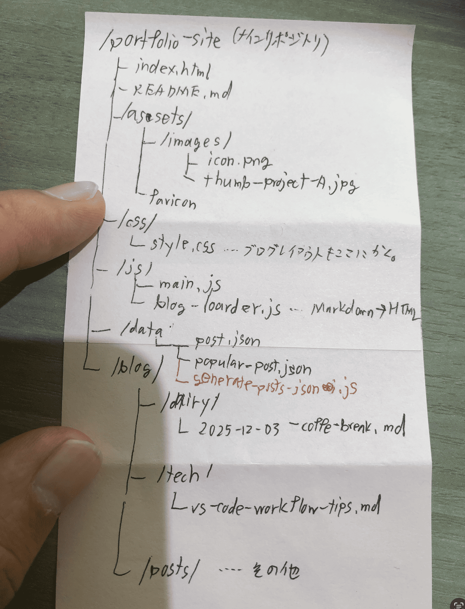
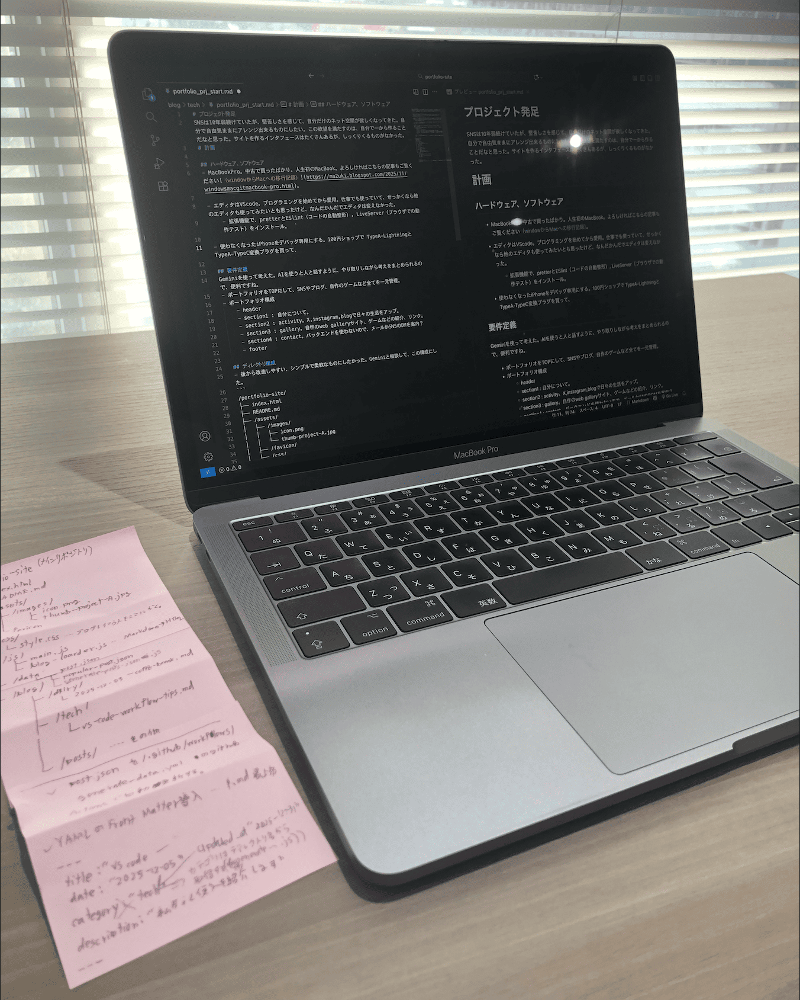
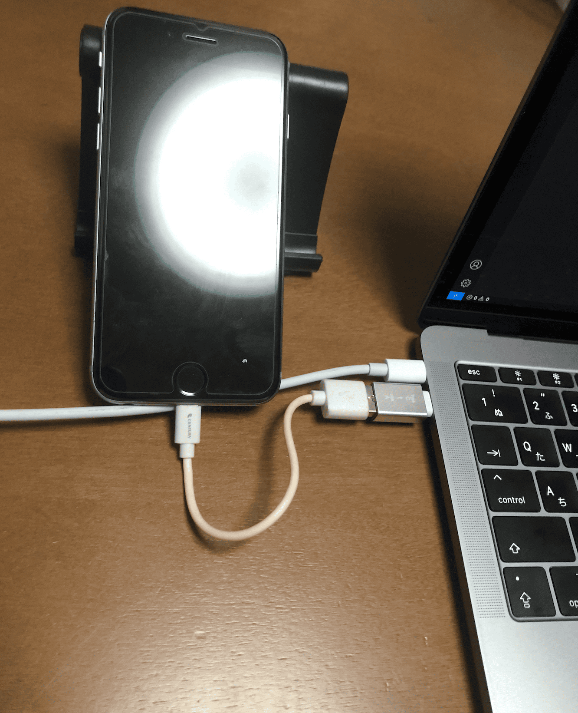

# プロジェクト発足

SNS は 10 年弱続けていたが、堅苦しさを感じて、自分だけのネット空間が欲しくなってきた。自分で自由気ままにアレンジ出来るものにしたい。この欲望を満たすのは、自分で一から作ることだなと思った。サイトを作るインタフェースはたくさんあるが、しっくりくるものがなかった。

# メモ

## ショートカットキー（⚠️Mac キーです ⚠️）

よく使うけど中々覚えられない。windows とごっちゃになる。

- `command + option + I` ブラウザで開発者ツール（Web インスペクタ）を開く。
- `command + control + R` ブラウザでレスポンシブモードを開く。
- `command + shift + 5` 画面録画メニューを開く。
- `command + control + esc` 画面収録を止める。
- `command + shift + 3` 画面全体のスクリーンショット
- `command + shift + 4` 画面一部分のスクリーンショット。
- `command + space` spotlight 検索。
- `command + M` ウィンドウ最小化（DOCK にしまう）。
- `control + ← or ⇨` デスクトップ切り替え。

## VScode の操作

- サイドバーを閉じて、画面を広くする。　`command + B`
- ファイルを開く。　`command + Shift + E` ⇨ `space`　 ⚠️Enter を押すとリネームになる。
- .md（マークダウンファイル）をプレビュー表示する。　`command + Shift + V`
- 画面を分割して、右に移動する。　`command + option + control + ¥` ⇨ ドラッグ&ドロップで右に移動。難しい 💦 これは二本指クリックで手動のほうがいいかも。
- copilot のチャット画面を開く。　`command + control + I`, `option + command + B`
- コマンドプロンプトから setting.json を開く。　`command + shift + P`　 ⇨ 「setting.json」で検索。「基本設定（ユーザーの〜）」をクリック。

## AI(Gemini,copilot)

- 手書きのディレクトリ構成図を写真に撮って、Gemini に「マークダウン形式で使えるようにして」と言ったら、上手に作ってくれた。下記の構成図がそれです。トリプルクオート（```）で囲んでコピペで出来ました。
  

## マークダウン

- コードを書く。` (```) ` ← トリプルクオートで前後を囲むってこと。
- 画像の挿入。`` ルートの書き方はその都度調べてください。

## ターミナル

- 現在の作業フォルダ(assets/image)にデスクトップからスクショを移動させる。  
  `mv ~/desktop/dir.png . `

# 計画

## ハードウェア、ソフトウェア

- MacBookPro。中古で買ったばかり。人生初の MacBook。よろしければこちらの記事もご覧ください[（window から Mac への移行記録）](https://ma2uki.blogspot.com/2025/11/windowsmacgitmacbook-pro.html)。

- エディタは VScode。プログラミングを始めてから愛用。仕事でも使っていて、せっかくなら他のエディタも使ってみたいとも思ったけど、なんだかんだでエディタは変えなかった。

  - 拡張機能で、pretter と ESlint（コードの自動整形）, LiveServer（ブラウザでの動作テスト）をインストール。
  - こちらも拡張機能で GitHub Copilot を導入。個人の無料枠。主に Agent モードで、Claude Haiku モデルを使う。個人的に使いやすい。

- GitHub でコード履歴を管理。リポジトリを作る。ここのブログ記事もこのリポジトリに入れていく。ゲームとかの制作物は、他のリポジトリを参照する形にする。

- ポートフォリオの公開（デブロイ）は、GitHub Pages。簡単に公開できる。バックエンドを使わないのもこれが理由。

- ブラウザ（Safari）で Gemini を開いておいて、分からないことは Gemini に聞く。Copilot は無料枠なので、すぐに制限がかかる。

- 使わなくなった iPhone をデバッグ専用にする。100 円ショップで TypeA-Lightning と TypeA-TypeC 変換プラグを買って、PC に繋ぐ。PC の開発者ツールでは問題なくても、スマホで動かすとうまくいかないことが結構あるんだよね。

- HTML,CSS,JavaScript。シンプルでコマ割りが効いて、AI も強いから。使い心地が良い。
- iPhone との連携。この連携の良さが、Mac の強み！作業日誌を残したいので、スマホで開発の雰囲気を写真にして、ネットでファイルサイズを小さくして、日誌に貼るとしようと思ったが、ちょっと大変。そこで、  
  スマホで写真に撮る　 ⇨ PC で「写真」を開く　 ⇨ スクリーンショット
  の流れにした。これだとファイルサイズも小さくて、.png で扱いやすい。iPhone 写真の.HEIC ファイルの扱いを知っておかないといけないな。

## 要件定義

Gemini を使って考えた。AI を使うと人と話すように、やり取りしながら考えをまとめられるので、便利ですね。

- ポートフォリオを TOP にして、SNS やブログ、自作のゲームなど全てを一元管理。
- ポートフォリオ構成
  - header
  - section1 : 自分について。
  - section2 : activity。X,instagram,blog で日々の生活をアップ。
  - section3 : gallery。自作の web gallery サイト、ゲームなどの紹介、リンク。
  - section4 : contact。バックエンドを使わないので、メールか SNS の DM を案内？
  - footer

## ディレクトリ構成

- 後から改造しやすい、シンプルで柔軟なものにしたかった。Gemini と相談して、この構成にした。

```
/portfolio-site/
├── index.html
├── README.md
├── /assets/
│   ├── /images/
│   │   ├── icon.png
│   │   └── thumb-project-A.jpg
│   ├── /favicon/
│   ├── /css/
│   │   └── style.css
│   ├── /js/
│   │   ├── main.js
│   │   └── blog-loader.js
│   └── /data/
│       ├── post.json
│       ├── popular-post.json
│       └── generate-posts-json.js
└── /blog/
    ├── /daily/
    │   └── 2025-12-03-coffe-break.md
    ├── /tech/
    │   └── vs-code-work-flow-tips.md
    └── /posts/
```

# 作業日誌

## First Phase

### 初日の振り返り

- 作業日誌を作る。記録は同時進行で残したいからね。ローカル（自分のパソコン）にディレクトリを作る。先にこの記事(.md)のファイル格納場所を作った。
  `~/src/portfolio-site`
- 作業日誌を書きながら、開発環境の整理と追加。アウトプットは大事だなと思いました。マークダウンは慣れたら書きやすい。
- VScode に Pretter と ESlint をインストール。setting.json で、保存をした時にリントが走るようにした。これらを入れておけば、改行とかの細かいコードのスタイルを自動で整えてくれる。ここは好みだと思うが、入力してすぐに整形するとコードがパッと変わって、「えっ？どこだっけ？」ってなったので、僕は目視で確認して、`command + S `　で整形されるようにしています。
- VScode の設定から、Auto Save 　を　 after delay 　にする。
  - この setting.json と Auto Save 設定で、僕がやりたい「変更は自動で保存されて、整形は com+S でやる」っていうのができる。
- 100 円ショップで TypeA-TypeC コネクタを購入。Lightning to C は高くて欲しい色がなかった。

  
  

#### 感想

- ほとんどこの記事作りだった。MacBook のショートカットやマークダウンの書き方を整理復習していたら、1 日が終わった。アウトプットはアウトプットで、やりやすい環境を整えてあげるのがいいなと思う。
- コードを書くこと以外の環境構築も手間がかかる。例えば開発風景を写真からこのファイルに入れるのも、ファイルサイズや拡張子を考えないといけない。プログラミングを始めた頃、Python で開発していた時は、アプリを作る以外のことはほとんどやらなかった（一応書いていた記事は　[(こちら)](https://ma2uki.blogspot.com/2025/03/python.html)）。
- 楽しみを忘れない。ブログを書くこと自体も楽しもうと思っているので、結構しっかり記録している。手間がかかることではあるので、人それぞれ状況に合わせて調整するのがいいのかなと思う。

### Instagram 用の写真撮影、リール動画編集

- 画像編集して、開発の流れをリール動画にしたかった。PC の写真 ⇨ 服装、コーヒー ⇨ カタカタやってる感じ　という大雑把な流れ。
- このブログはエンジニア寄りの専門用語も使う。Instagram は誰でも見て楽しい、開発の雰囲気。開発にハマってくると、エンジニアでない人には分かりづらいニッチな話ばかりになってしまうなと実感。ユーザー目線ってやつですね 🎵
- ~~iMovie~~ Instagram で動画編集。スマホの方が編集しやすかった。素材は PC で画面キャプチャ、iCloud でスマホに共有。Instagram アプリで編集した。

### ポートフォリオメイン画面作成
- html,css,jsファイル作成。
- SNSへのリンク、Xへのリンクはどうも安定しないみたい。。確かに429エラー（Too many request）でサムネイルが表示されない。Instagramはタイムラインの表示はできなくて、特定の投稿へのリンクならできるそう。それなら、スクショにリンクを貼る。2025年12月現在の話です。
- ポートフォリオサイトの目的は、信頼性向上。個人のSNSだけだと、中々信頼しづらいなぁと思い、作り始めた。だからこだわるのは、文章。HTML。見た目は派手じゃなくていい。ということで、htmlをざざっとつくって、スタイルはAIに任せる予定。