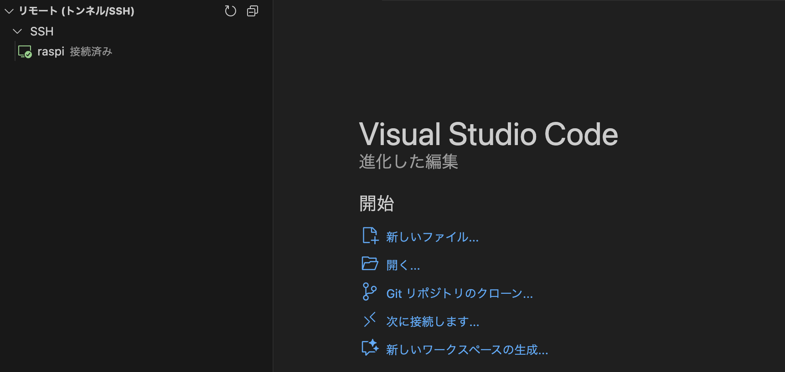
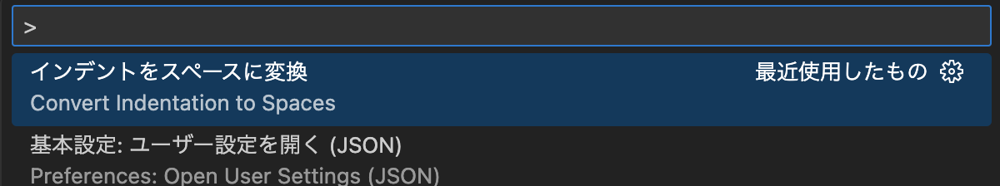
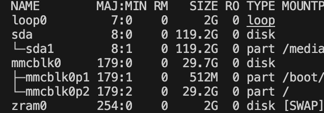
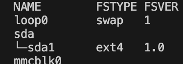
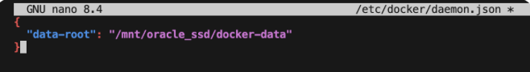
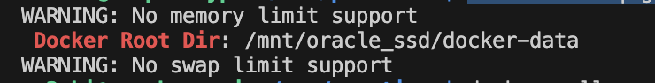
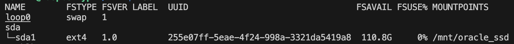
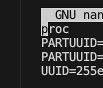
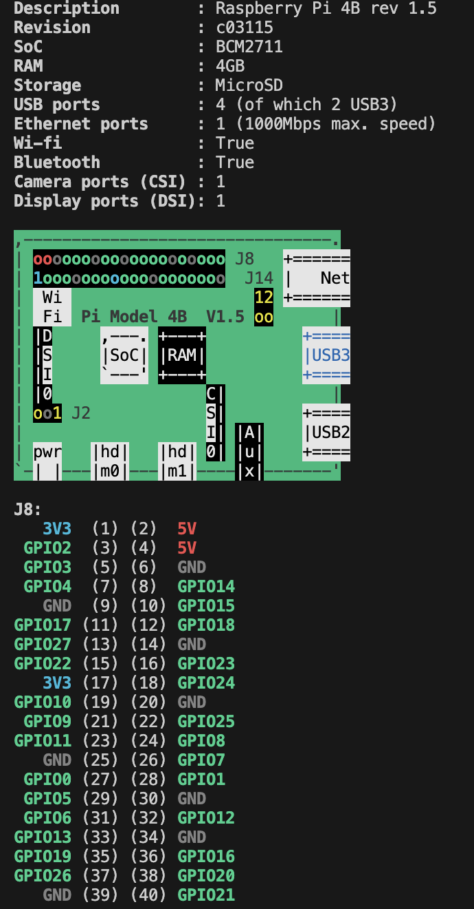

# Yuki Lab
## ラズパイの購入

## SSH接続
毎回線を繋ぎ直すのは大変だから、PCからラズパイを操作できるように、VScodeの拡張機能　でSSH接続をする。
- ラズパイIPアドレス固定
- VScode拡張機能インストール


- いざ接続！


- ラズパイをプログラムで光らせる。
```pinctrl set 4 op```　※メモリに書くだけだから、毎回やる。
```pinctrl get 4```
 4: op -- pu | lo // GPIO4 = output
```pinctrl set 4 dh```
```pinctrl set 4 dl```

- GPIOポートの一覧を確認
```pinctrl```

- ダウンロードしたファイルを変更できない　⇨　権限をrootから自分に変更
`sudo chown $USER buzzer.py`
- その後、確認
`ls -l buzzer.py`

- pythonコードで、タブとスペースが混ざってエラーが出る。
`command + shift + P`


## SSHをパスワード認証から公開鍵認証へ。
VPN接続をしようと思い、セキュリティで不安になったから、認証強化のため。
1. ```ssh-keygen -t ed25519``` でキーペア作成。ホームディレクトリで。  
```ls -a``` で隠しファイルも表示して、キーペアができたこと（.ssh）を確認。
1. 同じくホームディレクトリで ```ssh-copy-id ma2uki@192.168.1.59 ``` で公開鍵をラズパイに送る。
パスワードを聞かれるので入力。`Number of key(s) added:        1` が表示されればOK。
1. コマンドパレットで「構成ファイルを開く」。```IdentityFile ~/.ssh/id_ed25519```を追記する。
1. 再度SSH接続をして、パスワードを聞かれずに接続できたら成功！

## SSDをext4形式でフォーマット. 
`lsblk`. 
. 
`sudo umount /dev/sda1` アンマウントしてから
`sudo mkfs.ext4 /dev/sda1` フォーマット。
```. 
mke2fs 1.47.2 (1-Jan-2025)
/dev/sda1 contains a vfat file system
Proceed anyway? (y,N) y
Creating filesystem with 31258688 4k blocks and 7815168 inodes
Filesystem UUID: 255e07ff-5eae-4f24-998a-3321da5419a8
Superblock backups stored on blocks: 
        32768, 98304, 163840, 229376, 294912, 819200, 884736, 1605632, 2654208, 
        4096000, 7962624, 11239424, 20480000, 23887872

Allocating group tables: done                            
Writing inode tables: done                            
Creating journal (131072 blocks): done
Writing superblocks and filesystem accounting information: done   
```
`lsblk -f` でファイル形式を確認。  


- OSバージョンを調べる。`cat /etc/os-release`. 
- カーネルバージョンを調べる。`uname -a`. 
- OSのビット数を確認。 `getconf LONG_BIT`

## ~~Oracle DB をDocker image　で使う。~~ ⇨失敗。PostgreSQLに変更。
- Dockerをインストール。 `curl -sSL https://get.docker.com | sh` 
- JSONに設定を記載。 `sudo nano /etc/docker/daemon.json`. 
. 
- 再起動で設定を読み込ませる。 `sudo systemctl restart docker`. 
- 確認。 `docker info | grep "Docker Root Dir"`. 
. 
- イメージをpull `docker pull container-registry.oracle.com/database/free:latest`
    １時間くらいかかった。  
- `sudo mkdir -p /mnt/oracle_ssd/oradata` ボリュームマウント用ディレクトリ作成. 
- `sudo chmod 777 /mnt/oracle_ssd/oradata` フォルダ権限をフルオープン。
- `ls -ld /mnt/oracle_ssd/oradata` フォルダ権限を確認。


## 自動マウント設定

Linuxのファイルシステムを確認. 
```. 
raspberrypi:/ $ ls
bin  boot  dev  etc  home  lib  lost+found  media  mnt  opt  proc  root  run  sbin  srv  sys  tmp  usr  var. 
```

ラズパイに接続ポイントを作成　`mkdir -p /mnt/oracle_ssd`　/⚪︎⚪︎~は絶対パス. 
`sudo mount /dev/sda1 /mnt/oracle_ssd` マウント先を設定。  
`lsblk -f` で確認。
. 

`curl inet-ip.info` グローバルIPアドレスを確認。
`sudo blkid /dev/sdb1` UUIDを確認。
`sudo nano /etc/fstab` でUUIDを追記。

`cont + O` `Enter` `cont + X` で保存。
テスト
`sudo umount /mnt/oracle_ssd` 一度アンマウント
`sudo mount -a`
```. 
sudo mount -a
mount: (hint) your fstab has been modified, but systemd still uses
       the old version; use 'systemctl daemon-reload' to reload.  
```
`sudo systemctl daemon-reload` アドバイス通りに設定を読み直す。  
`sudo mount -a` 再びマウント
`lsblk -f` で確認。

## Docker でPostgreSQLをインストール. 
設定を変えてもバージョンを落としても、結局OracleDBはインストールできず、より軽量なPostgreSQLのDocker環境を作ることにした。
- フォルダ名も変えたいから、SSD自動マウントから再設定。
- `docker images` で、イメージの一覧を取得。  
- `docker ps -a` で、コンテナ一覧を取得。  
- `docker rm -f [コンテナID]` で、実行中コンテナを強制削除。
- `docker rmi -f [imageID]` で、イメージ削除。 
- ディレクトリ名の変更と作成. 
- `sudo mkdir -p /mnt/ssd_silver`
- Docker自体をStopする。 `sudo systemctl stop docker.socket` , `sudo systemctl stop docker`. 
- それからunmount `sudo umount /mnt/oracle_ssd`. 
- 削除 `sudo rmdir /mnt/oracle_ssd`. 
- 再度自動マウント設定

- Docker再起動`sudo systemctl start docker.socket`, `sudo systemctl start docker`
- DB用ディレクトリ作成、権限設定`sudo mkdir -p /mnt/ssd_silver/pgdata`, `sudo chmod -R 777 /mnt/ssd_silver/pgdata`. 
```docker run -d \
  --name postgres-db \
  -e POSTGRES_PASSWORD=⚪︎⚪︎ \
  -p 5432:5432 \
  -v /mnt/ssd_silver/pgdata:/var/lib/postgresql \
  --restart always \
  arm64v8/postgres:latest
```
- ちゃんとできたかを確認 `docker logs postgres-db`, `docker ps`, `docker info | grep "Root Dir"`. 
- コンテナごとの詳細情報を表示。 `docker inspect <コンテナ名またはID> | grep -i "mounts" -A 10`. 

## Minecraft Pi Reboon とscratch3のインストール、リモートデスクトップで遊ぶ. 
まずはマイクラのインストール 
- リポジトリキーの保存 `sudo curl https://gitea.thebrokenrail.com/api/packages/minecraft-pi-reborn/debian/repository.key -o /etc/apt/keyrings/minecraft-pi-reborn.asc`. 
- ソースリストに追加. 
`echo 'deb [signed-by=/etc/apt/keyrings/minecraft-pi-reborn.asc] https://gitea.thebrokenrail.com/api/packages/minecraft-pi-reborn/debian stable main' | sudo tee -a /etc/apt/sources.list.d/minecraft-pi-reborn.list`. 
- apt更新 `sudo apt update`. 
- インストール `sudo apt install minecraft-pi-reborn`. 
- インストールできたのかを確認 `minecraft-pi-reborn --version`. 

スクラッチのインストール. 
- apt更新 `sudo apt update`. 
- インストール `sudo apt install scratch3`. 
- インストール確認。名前がちょっと違うから気をつけて。 `scratch-desktop --version`. 

リモートデスクトップ接続. 
- まずはラズパイでVNC接続を有効にする。 `sudo raspi-config` 「3 Interface Options」, 「I3 VNC」
- Mac側にVNC Viewer をインストール。手順は調べながらやった。 [(RealVNCWebページ)](https://www.realvnc.com/en/connect/download/viewer/). 
- TailscaleのIPアドレス確認。 `tailscale ip -4`. 
- おまけにキーボードをUS配列にした。 `sudo nano /etc/default/keyboard`, jp のところをus にした。   

途中でやった諸々コマンド. 
- useenameを忘れた。 `whoami`. 

## dockerに入って、postgreSQLチュートリアルをやる。
- `docker exec -it postgres-db /bin/bash` コンテナに入る。  
- `psql -U postgres` PostgreSQLにログイン. 
- `\l` DB一覧を確認。  
- `\q` DBから出る。  
- `exit` dockerから出る。  
- `docker exec -it postgres-db psql -U postgres` 一発でログイン.  
- psqlは、セミコロンで終わるまでそのコマンドは継続するものと認識します。  
- `\dt` テーブル確認コマンド。  
- `SELECT * FROM weather;` テーブルの中身を確認。
## Lチカ
- 実行
```python3 led.py```
- ストップ
```Control + C```

## rsync でラズパイへ転送。  
`rsync -av ~/notes/ raspi:/mnt/ssd_silver/notes/` フォルダ全体を送る。  
`rsync -av ~/notes/20260617.md raspi:/mnt/ssd_silver/notes/` ファイルを指定して送る。  
`@raspberrypi:~/note-sync $ node import-notes.js` 

## ピンの番号が分からない時は
```pinout```   

こんな画像と設定が出てくる。  




## memo
- Pythonのバージョン確認
```python3 --version```. 
- diskの空き容量確認 `df -h`. 
- パーテーション構造をツリーで表示 `lsblk`. 